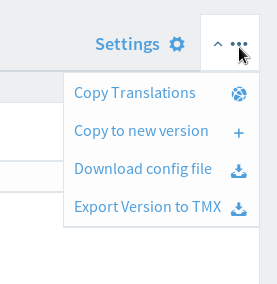

# Configuring the Client

zanata-cli requires User Configuration and Project-Version Configuration.

## User Configuration

User configuration stores your credentials so that zanata-cli can prove to the server that requests are from you rather than an imposter. The information in your user config should be kept secret.

zanata-cli expects to find user configuration in `.config/zanata.ini` within your user directory.

To add configuration for a Zanata server:

 1. Use your favourite text editor to create or open `zanata.ini` in `~/.config/`.
 1. Sign into the Zanata server and navigate to the user settings page
 1. Ensure that an API Key is shown. If you do not have an API Key, click 'Generate API Key' now.


 1. Copy the contents of the text-box labeled 'Configuration [zanata.ini]'.
 1. Paste the copied lines into `zanata.ini` and save the file.


## Project-Version Configuration

Project configuration stores information about a project-version, and should be kept in the project directory.

zanata-cli expects to find project-version configuration in a file named `zanata.xml` in the project directory.

To add project-version configuration to your project directory:

 1. Sign into the Zanata server and navigate to the appropriate version of your project.
 1. Click the `Download config file` link to initiate download of `zanata.xml`.


 1. Save `zanata.xml` in your project directory.


These steps should be repeated for each project-version before using any zanata-cli commands for the project-version.

You can customize `zanata.xml` with command hooks so that other tools will automatically run before or after Zanata commands. Read about command hooks at the [command hook page on the wiki](https://github.com/zanata/zanata-server/wiki/Client-Command-Hooks).


## Locale Configuration

The `zanata.xml` will contain a list of locales so that the client knows which locales to push and pull to/from the Zanata server. When downloaded from the Zanata server, the list will have the locales as specified by the server itself. It will look something like this:

```xml
<locales>
  <locale>es</locale>
  <locale>ja</locale>
  <locale>fr</locale>
  <locale>zh-Hant-TW</locale>
  ...
</locales>
```

Sometimes the way locales are named in your project files doesn't match Zanata's locale nomenclature, so it's necessary to create a mapping between the two. You can achieve this in the client by modifying the locale entries in `zanata.xml`.

For instance, if one of your files is called `myfile/es.po` and your project in Zanata has the `es-ES` locale, then your client mappng would look like this:

```xml
  <locale map-from='es'>es-ES</locale>
```

### Translation files mapping rules

You can also customize the way translation files are found when pushing, as well as the location they will be saved to when pulling.

<!-- example rules definition in zanata.xml -->
<rules>
  <rule pattern="**/pot/*.pot">{locale}/{path}/{filename}.po</rule>
  <rule pattern="**/po/*.pot">{path}/{locale_with_underscore}.po</rule>
</rules>


In the example above, `pattern` identifies a source file, and the contents of the `rule` element specify how translation files will be stored.

The `pattern` attribute is a [glob](http://en.wikipedia.org/wiki/Glob_(programming)) matching pattern to your source document file(s). You can define more than one rule and apply each rule to a specific set of source documents using different patterns. The **first** matched rule will be applied to the file. 

`pattern` is optional. If not specified, the rule will be applied to all source documents in your project.
The actual rule consists of literal path and placeholders/variables.

Supported placeholders/variables are:
 
 1. **{path}** is the path between source document root (what you define as src-dir option) and the final file.
 1. **{filename}** the source document name without leading path and extension.
 1. **{locale}** the locale for the translation file. If you use "map-from" argument in your locale mapping, this will be the map-from value.
 1. **{locale\_with\_underscore}** same as above except all hyphens '-' will be replaced with underscores '_'. This is typically used in properties and gettext projects.
 1. **{extension}** the source document file extension

For example, given a source document is found at `/home/user/myproject/src/main/resource/message.properties` 

... and your source document root (src-dir option) is set to "." 

... Your zanata.xml is located at `/home/user/myproject` 

... For a locale mapping defined as `<locale map-from="zh-CN">zh</locale>`: 


The following placeholders will be detected:

```
{path}                     = 'src/main/resource'
{filename}                 = 'message'
{locale}                   = 'zh-CN'
{locale\_with\_underscore} = 'zh_CN'
{extension}                = 'properties' 
```


The mapping rules configuration is optional in zanata.xml. If not specified, standard rules are applied according to your [project type](https://github.com/zanata/zanata-server/wiki/Project-Types).

 1. gettext: `{path}/{locale_with_underscore}.po`
 1. podir: `{locale}/{path}/{filename}.po`
 1. properties: `{path}/{filename}_{locale_with_underscore}.{extension}`
 1. utf8properties: `{path}/{filename}_{locale_with_underscore}.{extension}`
 1. xliff: `{path}/{filename}_{locale_with_underscore}.{extension}`
 1. xml: `{path}/{filename}_{locale_with_underscore}.{extension}`
 1. file: `{locale}/{path}/{filename}.{extension}`  

---

[Old instructions](https://github.com/zanata/zanata-server/wiki/Client-Configuration)
